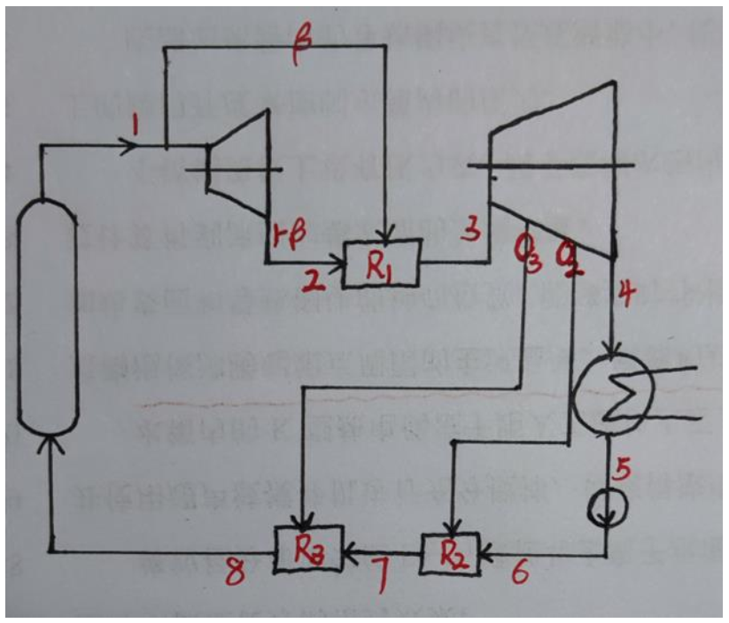
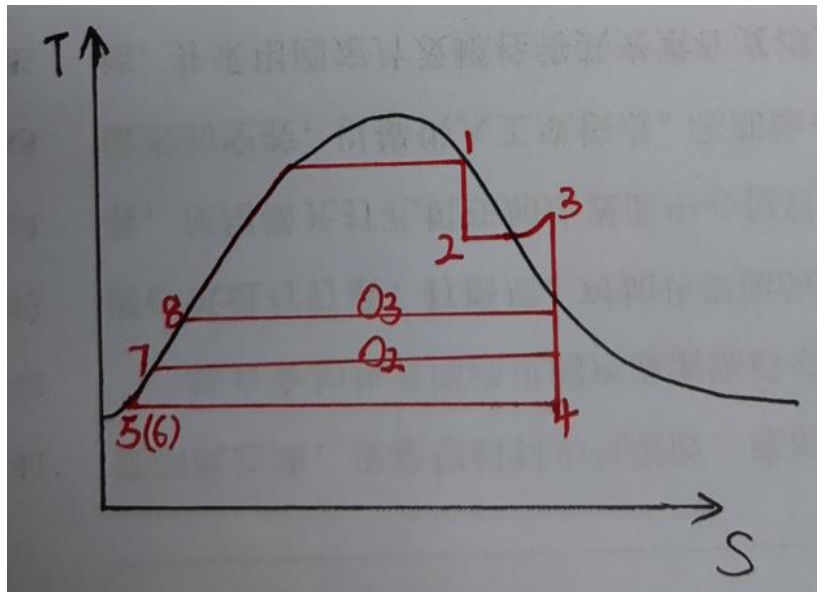
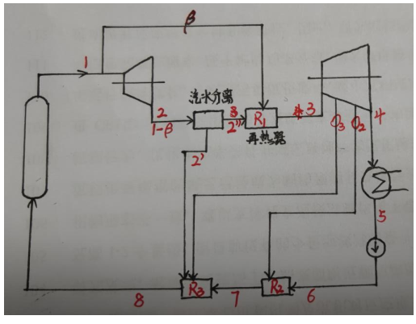
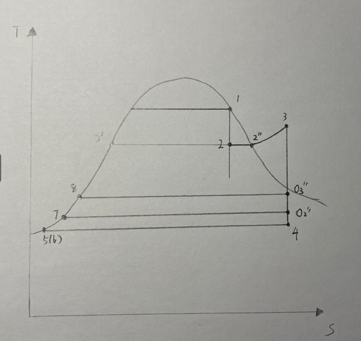

# 热力系统设计与实践第一次作业

## Question

*对于一个具有再热的两级回热理想循环（抽气压力分别为0.8 $MPa$和0.2 $MPa$），蒸汽发生器出口新蒸汽压力4 $MPa$，干度0.9975；绝热膨胀后排出，排气压力为新蒸汽压力的30%，经蒸汽再热到190℃；低压缸绝热膨胀，乏汽冷凝压力4 $kPa$。不考虑泵做功。*

*假定新蒸汽总流量为1kg/s；用于再热的新蒸汽流量为$\beta$，两级回热的抽汽流量分别为$\alpha 1$和$\alpha 2$，给水温度为$T_{fw}$，高压缸排气压力为$P_a$。*

1. *用于再热的新蒸汽和高压缸排气直接混合进行再热，推导循环热效率表达式，并计算循环热效率；（3分）*
2. *假设再热器再热蒸汽之前，对湿蒸气进行汽水分离，分离效率100%，推导循环热效率表达式，并计算循环热效率；（4分）*
3. *改变抽气压力，分析抽气压力对循环热效率影响。（3分）*

## Answer

### 1) 用于再热的新蒸汽和高压缸排气直接混合进行再热，推导循环热效率表达式，并计算循环热效率

热力系统如图：



循环表示为：



循环热效率可以表示为：

$$
w_t = \frac{w_{net}}{q_1} = 1 - \frac{q_2}{q_1} \\
q_1 = h_1 - h_{8} \\
q_2 = (1 - \alpha_1 - \alpha_2)(h_4 - h_5)
$$

$h_1$，$h_4$，$h_5$，$h_8$可以通过查表得到，$\alpha_1$, $\alpha_2$可以通过回热器的能量平衡方程计算。

对于回热器$R2$，有

$$
(1 - \alpha_1 - \alpha_2)h_{6} + \alpha_2 h_{o_2} = (1 - \alpha_1)h_{7}  \\
\alpha_2 = \frac{(1 - \alpha_1)(h_{7}-h_{6})}{h_{o_2} - h_{6}}
$$

对于回热器$R3$，有

$$
(1 - \alpha_1)h_{7} + \alpha_1 h_{o_3} = h_{8}  \\
\alpha_1 = \frac{h_{8} - h_{7}}{h_{o_3} - h_{7}}
$$

|     参数     |   单位   |                           计算公式或来源                           | 计算数值 |
| :----------: | :-------: | :----------------------------------------------------------------: | :------: |
|  $h_{1}$  | $kJ/kg$ |                           $由P,x查表$                           | 2796.61 |
|  $h_{4}$  | $kJ/kg$ |                           $由P,s查表$                           | 1967.77 |
|  $h_{5}$  | $kJ/kg$ |                           $由P,x查表$                           |  121.40  |
|  $h_{6}$  | $kJ/kg$ |                           $由P,x查表$                           |  121.40  |
|  $h_{7}$  | $kJ/kg$ |                           $由P,x查表$                           |  504.68  |
|  $h_{8}$  | $kJ/kg$ |                           $由P,x查表$                           |  721.02  |
| $h_{o_2}$ | $kJ/kg$ |                           $由P,s查表$                           | 2473.03 |
| $h_{o_3}$ | $kJ/kg$ |                           $由P,s查表$                           | 2711.73 |
| $\alpha_1$ |  $\%$  |        $\alpha_1 = \frac{h_{8} - h_{7}}{h_{o_3} - h_{7}}$        |   9.8   |
| $\alpha_2$ |  $\%$  | $\alpha_2 = \frac{(1 - \alpha_1)(h_{7}-h_{6})}{h_{o_2} - h_{6}}$ |   14.7   |

由此可得：

$$
q_1 = h_1 - h_{8} = 2796.61 - 721.02 = 2075.59 kJ/kg\\
q_2 = (1 - \alpha_1 - \alpha_2)(h_4 - h_5) = (1 - 0.098 - 0.147) \times(1967.77 - 121.40) = 1394.01 kJ/kg
$$

即

$$
w_t = \frac{w_{net}}{q_1} = 1 - \frac{q_2}{q_1} = 32.84\%
$$

### 2) 假设再热器再热蒸汽之前，对湿蒸气进行汽水分离，分离效率100%，推导循环热效率表达式，并计算循环热效率

热力系统如图：


循环表示为：


根据能量守恒列平衡方程

对于换热器有：

$$
x_2(1-\beta)h_{2''} + \beta h_1 = (x_2 +\beta - \beta x) h_3 \\
\beta = \frac{xh_{2''} - x h_3}{h_3 - h_3 x - h_1 +xh_{2''}}
$$

对于回热器$R2$，有

$$
(x_2 +\beta - \beta x - \alpha_1 - \alpha_2)h_{6} + \alpha_2 h_{o_2} = (x_2 +\beta - \beta x - \alpha_1)h_{7}  \\
\alpha_2 = \frac{(x_2 +\beta - \beta x - \alpha_1)h_6 - (x_2 +\beta - \beta x - \alpha_1)h_{7} }{h_{6} - h_{o_2}}
$$

对于回热器$R3$，有

$$
(x_2 +\beta - \beta x - \alpha_1)h_{7} + \alpha_1 h_{o_3} + (1 - \beta)(1 - x)h_{2'}  = h_{8}  \\
\alpha_1 = \frac{(x+\beta - \beta x)h_7 +(1-\beta)(1-x)h_{2'}-h_8}{h_7 - h_{o_3}}
$$

|     参数     |   单位   |                                                    计算公式或来源                                                    | 计算数值 |
| :----------: | :-------: | :-------------------------------------------------------------------------------------------------------------------: | :------: |
|    $x$    |   $-$   |                                                     $由P,s查表$                                                     |  0.8950  |
|  $h_{1}$  | $kJ/kg$ |                                                     $由P,x查表$                                                     | 2796.61 |
|  $h_{2'}$  | $kJ/kg$ |                                                     $由P,x查表$                                                     |  798.50  |
| $h_{2''}$ | $kJ/kg$ |                                                     $由P,x查表$                                                     | 2783.77 |
|  $h_{4}$  | $kJ/kg$ |                                                     $由P,s查表$                                                     | 1967.77 |
|  $h_{5}$  | $kJ/kg$ |                                                     $由P,x查表$                                                     |  121.40  |
|  $h_{6}$  | $kJ/kg$ |                                                     $由P,x查表$                                                     |  121.40  |
|  $h_{7}$  | $kJ/kg$ |                                                     $由P,x查表$                                                     |  504.68  |
|  $h_{8}$  | $kJ/kg$ |                                                     $由P,x查表$                                                     |  721.02  |
| $h_{o_2}$ | $kJ/kg$ |                                                     $由P,s查表$                                                     | 2473.03 |
| $h_{o_3}$ | $kJ/kg$ |                                                     $由P,s查表$                                                     | 2711.73 |
|  $\beta$  |  $\%$  |                           $\beta = \frac{xh_{2''} - x h_3}{h_3 - h_3 x - h_1 +xh_{2''}}$                           |  41.52  |
| $\alpha_1$ |  $\%$  |                 $\alpha_1 = \frac{(x+\beta - \beta x)h_7 +(1-\beta)(1-x)h_{2'}-h_8}{h_7 - h_{o_3}}$                 |   8.98   |
| $\alpha_2$ |  $\%$  | $\alpha_2 = \frac{(x_2 +\beta - \beta x - \alpha_1)h_6 - (x_2 +\beta - \beta x - \alpha_1)h_{7} }{h_{6} - h_{o_2}}$ |  13.83  |

由此可得：

$$
q_1 = h_1 - h_{8} =  2075.59kJ/kg\\
q_2 = [1 - (1 - \beta)\times(1-x)- \alpha_1 - \alpha_2](h_4 - h_5) =  1311.69kJ/kg
$$

即

$$
w_t = \frac{w_{net}}{q_1} = 1 - \frac{q_2}{q_1} = 36.80\%
$$

### 3) 改变抽气压力，分析抽气压力对循环热效率影响

计算程序如下：

```python
from iapws import IAPWS97 as ip
import numpy as np

def get_alpha_1(p1, p2):
    x = 0.8950
    h3 = 2789.45
    h1 = 2796.61
    h2pp = 2783.77
    h2p = 798.5
    h7 = ip(P = p2, x = 0).h
    h8 = ip(P = p1, x = 0).h
    ho3 = ip(P = p1, s = 6.534).h
    beta = 0.4152
    return ((x + beta - beta*x)*h7 + (1-beta)*(1-x)*h2p - h8)/(h7 - ho3)

def get_alpha_2(a1, p1, p2):
    x = 0.8950
    h3 = 2789.45
    h1 = 2796.61
    h2pp = 2783.77
    beta = 0.4152
    h2p = 798.5
    h6 = 121.4
    h7 = ip(P = p2, x = 0).h
    h8 = ip(P = p1, x = 0).h
    ho2 = ip(P = p2, s = 6.534).h
    ho3 = ip(P = p1, s = 6.534).h
    return ((x+beta-beta*x-a1)*h6 - (x+beta-beta*x-a1)*h7)/(h6 - ho2)

def get_q_2(b, a1, a2):
    x = 0.895
    h4 = 1967.77
    h5 = 121.40
    return (1 - (1-b)*(1-x)-a1-a2)*(h4 - h5)

def get_w(q2):
    return (1 - q2/2075.59)

mat = np.empty([5,5], dtype = float) 

for i in range(5):
    for j in range(5):

        m = [0.6, 0.7, 0.8, 0.9, 1.0]
        n = [0.01, 0.1, 0.2, 0.3, 0.4]
        p_01 = m[i]
        p_02 = n[j]
      
        b = 0.4152
        a1 = get_alpha_1(p_01, p_02)
        a2 = get_alpha_2(a1, p_01, p_02)

        q2 = get_q_2(b, a1, a2)

        w_t = get_w(q2)
        if i == 2 and j == 2:
            print(b, a1, a2, w_t, q2)
        mat[i][j] = w_t

print(mat)

```

计算结果如下：

| **抽气压力(MPa)** | **0.6** | **0.7** | **0.8** | **0.9** | **1.0** |
| ----------------------- | ------------- | ------------- | ------------- | ------------- | ------------- |
| **0.01**          | 0.34866411    | 0.35423918    | 0.35222027    | 0.34982848    | 0.3474607     |
| **0.1**           | 0.35609172    | 0.36232593    | 0.36065282    | 0.35851569    | 0.35635875    |
| **0.2**           | 0.36263428    | 0.36942122    | 0.36803946    | 0.366117      | 0.36413778    |
| **0.3**           | 0.36849501    | 0.3757552     | 0.37462404    | 0.37288635    | 0.37106014    |
| **0.4**           | 0.37381368    | 0.38148563    | 0.38057354    | 0.3789975     | 0.37730517    |

## Appendix

物性查找图形程序如下：

```python
import sys
from PyQt5.QtWidgets import QApplication, QWidget, QLabel, QLineEdit, QPushButton, QVBoxLayout, QHBoxLayout
import iapws

class SteamCalculator(QWidget):
    def __init__(self):
        super().__init__()

        # 初始化界面
        self.initUI()

    def initUI(self):
        # 标签和输入框
        self.lbl_inputs = QLabel("请输入以下两个参数")
        self.lbl_param1 = QLabel("压强(P)(MPa)")
        self.le_param1 = QLineEdit()
        self.lbl_param3 = QLabel("温度(T)(℃)")
        self.le_param3 = QLineEdit()
        self.lbl_param4 = QLabel("焓(h)(kJ/kg)")
        self.le_param4 = QLineEdit()
        self.lbl_param5 = QLabel("熵(s)(kJ/(kg*K))")
        self.le_param5 = QLineEdit()
        self.lbl_param6 = QLabel("干度(x) - ")
        self.le_param6 = QLineEdit()

        # 按钮
        self.btn_calculate = QPushButton("计算")
        self.btn_calculate.clicked.connect(self.calculate)

        # 结果标签
        self.lbl_outputs = QLabel("计算结果：")

        # 布局
        vbox_inputs = QVBoxLayout()
        vbox_inputs.addWidget(self.lbl_inputs)
        hbox_param1 = QHBoxLayout()
        hbox_param1.addWidget(self.lbl_param1)
        hbox_param1.addWidget(self.le_param1)
        vbox_inputs.addLayout(hbox_param1)
        hbox_param3 = QHBoxLayout()
        hbox_param3.addWidget(self.lbl_param3)
        hbox_param3.addWidget(self.le_param3)
        vbox_inputs.addLayout(hbox_param3)
        hbox_param4 = QHBoxLayout()
        hbox_param4.addWidget(self.lbl_param4)
        hbox_param4.addWidget(self.le_param4)
        vbox_inputs.addLayout(hbox_param4)
        hbox_param5 = QHBoxLayout()
        hbox_param5.addWidget(self.lbl_param5)
        hbox_param5.addWidget(self.le_param5)
        vbox_inputs.addLayout(hbox_param5)
        hbox_param6 = QHBoxLayout()
        hbox_param6.addWidget(self.lbl_param6)
        hbox_param6.addWidget(self.le_param6)
        vbox_inputs.addLayout(hbox_param6)
        vbox_inputs.addWidget(self.btn_calculate)
        vbox_outputs = QVBoxLayout()
        vbox_outputs.addWidget(self.lbl_outputs)

        hbox = QHBoxLayout()
        hbox.addLayout(vbox_inputs)
        hbox.addLayout(vbox_outputs)

        self.setLayout(hbox)

        # 设置窗口
        self.setGeometry(400, 400, 600, 250)
        self.setWindowTitle('水蒸气物性参数计算器')
        self.show()

    def calculate(self):
        # 获取用户输入的参数
        param1 = self.le_param1.text()
        # param2 = self.le_param2.text()
        param3 = self.le_param3.text()
        param4 = self.le_param4.text()
        param5 = self.le_param5.text()
        param6 = self.le_param6.text()

        # 确定已知参数的数量
        known_params = [p for p in [param1, param3, param4, param5, param6] if p]
        num_known_params = len(known_params)

        # 检查已知参数数量是否为2
        if num_known_params != 2:
            self.lbl_outputs.setText("请输入两个已知参数")
            return

        # 判断用户输入的已知参数是哪两个，并将其转换为浮点数
        if param1 and param3:
            try:
                # 可能会导致错误的代码
                p = float(param1)
                T = float(param3)+273.15
                steam = iapws.IAPWS97(P=p, T=T)  
            except:
                # 处理捕获的异常
                self.lbl_outputs.setText("出错,超出输入范围")

        elif param1 and param4:
            try:
                p = float(param1)
                h = float(param4)
                steam = iapws.IAPWS97(P=p, h=h)

            except:
                # 处理捕获的异常
                self.lbl_outputs.setText("出错,超出输入范围")
        elif param1 and param5:
            try:
                p = float(param1)
                s = float(param5)
                steam = iapws.IAPWS97(P=p, s=s)

            except:
                # 处理捕获的异常
                self.lbl_outputs.setText("出错,超出输入范围")

        elif param4 and param5:
            try:
                h = float(param4)
                s = float(param5)
                steam = iapws.IAPWS97(h=h, s=s)

            except:
                # 处理捕获的异常
                self.lbl_outputs.setText("出错,超出输入范围")
  
        elif param6 and param1:
            try:
                x = float(param6)
                p = float(param1)
                steam = iapws.IAPWS97(x=x, P=p)

            except:
                # 处理捕获的异常
                self.lbl_outputs.setText("出错,超出输入范围")  

        elif param6 and param3:
            try:
                x = float(param6)
                T = float(param3)+273.15
                steam = iapws.IAPWS97(x=x, T=T)

            except:
                # 处理捕获的异常
                self.lbl_outputs.setText("出错,超出输入范围")

        else:
            self.lbl_outputs.setText("请输入两个有效参数")
            return
  
        # 显示计算结果
        try:
            # 可能会导致错误的代码
            self.lbl_outputs.setText(f"Phase = {steam.phase}\nrho = {steam.rho:.3f} kg/m³\nP = {steam.P:.3f} MPa\nv = {steam.v:.6f}m^3/kg\nT = {steam.T-273.15:.3f} ℃\nh = {steam.h:.3f} kJ/kg\ns = {steam.s:.6f} kJ/(kg*K)\nx = {steam.x:.6f}")
  
        except:
            # 处理捕获的异常
            self.lbl_outputs.setText("出错,请检查输入")

if __name__ == '__main__':
    app = QApplication(sys.argv)
    ex = SteamCalculator()
    sys.exit(app.exec_())
```
